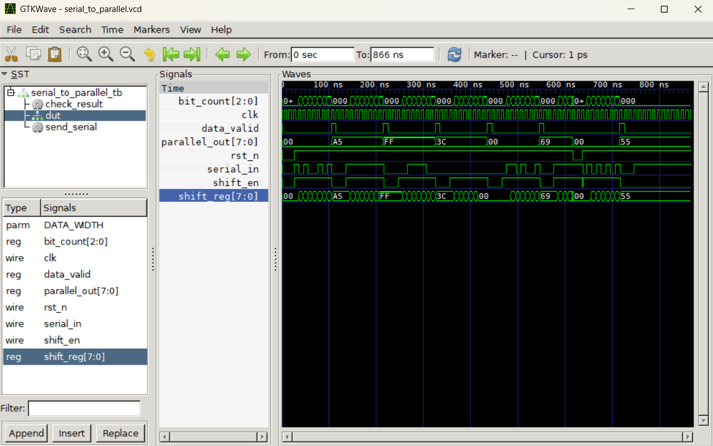

# SerialtoParallelConverter
8-bit Serial-in Parallel-out (SIPO) shift register implementation using Verilog HDL.
Simulation Results

To verify the design, a testbench was used and the simulation results were visualized using GTKWave. The waveform below demonstrates the transition from serial input to parallel output.



## Files
- `serial_to_parallel.v`    – Main Verilog module (8-bit shift register design)
- `serial_to_parallel_tb.v` – Testbench (7 test vectors, all passing)
- `serial_to_parallel.vcd`  – GTKWave waveform dump (from simulation)
- `report.docx`             – Academic report

## How to Simulate
```bash
# 1. Compile
iverilog -o sim_out serial_to_parallel_tb.v serial_to_parallel.v

# 2. Run simulation
vvp sim_out

# 3. View waveforms
gtkwave serial_to_parallel.vcd
```

## Requirements
- iverilog (Icarus Verilog): sudo apt install iverilog
- gtkwave:                   sudo apt install gtkwave
